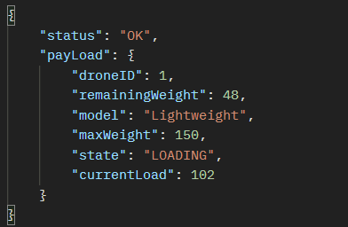

# Drone fleet Application

## Pre-requisites
    - Java 17
    - Maven 3.x
  

| Method | URI                      | Description                              | Sample Payload | Response                             |
|--------|--------------------------|------------------------------------------|----------------|--------------------------------------|
| POST   | /drone-management/drones | Registers a new Drone                    |                |                                      |
| PUT    | /drone-management/drones/{id}/medical-item-line                        | Loads medication items for a given drone |                | `{ "medicationID": 12, "quantity": 5}` |
|        |                          |                                          |                |                                      |
|        |                          |                                          |                |                                      |
