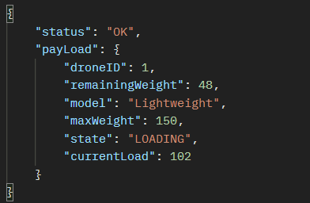
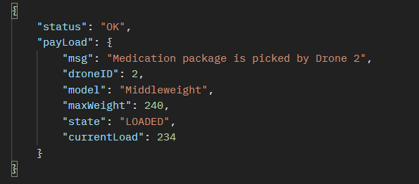
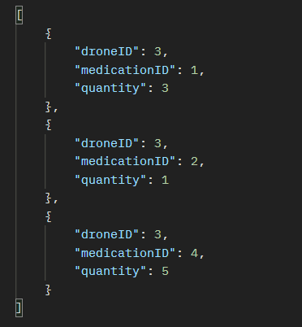
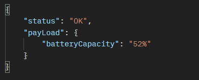

# Drone fleet Application

## Pre-requisites
   * Java 17
   * Maven 3.x
  
| Method | URI                                             | Description                                                                                                                           | Sample Payload             | Response                                                         |
|--------|-------------------------------------------------|---------------------------------------------------------------------------------------------------------------------------------------|----------------------------|------------------------------------------------------------------|
| POST   | /drone-management/drones                        | Registers a new Drone                                                                                                                 |    |                                                                  |
| PUT    | /drone-management/drones/{id}/medical-item-line | Loads medication items for a given drone                                                                                              |  |  |
| PUT    | /drone-management/medical-item-line             | Automatically picks any available drone to load a medicine item                                                                       |  |                                                                  |
| GET    | /drone-management/drones/3/medical-items        | Retrieves loaded medication items for a given drone                                                                                   | N/A                        |                                                                  |
| GET    | /drone-management/available-drones              | Gets all avaliable drones for items loading. Drones in IDLE/LOADING state and battery level is not below than 25% meets this criteria | N/A                        |                                                                                         |
| GET    | /drone-management/drone-info/{id}/battery-level | Checks drone battery level for a given drone                                                                                          | N/A                        |                                                                                         |
| GET    | /drone-management/drones                        | Retrieves all resigtered drone details                                                                                                | N/A                        |                                                                                                                |
