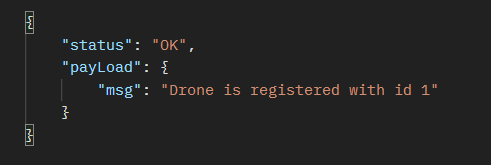
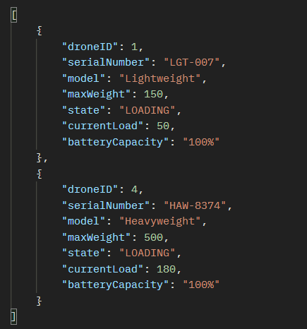

# Drone fleet Application

## Pre-requisites
   * Java 17
   * Maven 3.x

### Instructions
Please clone the repository using SSH or HTTP protocol. Then navigate the fetched directory and checkout the `main` branch. 

#### Running from IDE
* Import the maven project to your IDE and change application properties (server port) if required. Build the project using `mvn clean install` or `mvn clean install -DskipTests`
* Once built is successful, use the IDE to run the main class `DroneFleetAppApplication`

#### Using the Maven plugin
Without importing project to IDE, you could run the same Maven build commands in CLI as above to build the project. Upon completion please invoke the spring boot maven plugin run goal as below.
`mvn spring-boot:run`

#### Running as a packaged application
Maven build command create an executable jar on build completion. You can run application by executing the generated jar file too.
`java -jar target/droneFleetApp-1.0.0-SNAPSHOT.jar`

Tomcat server port is configured to use **8082** by default. Could be reconfigured to use a different port in application.yml

**Note:** Drone model and state columns are mapped as enums in JPA Entity since all possible values are pre-defined. Please use the exact names when using any of them in request payloads.

### Database
Application is configured to use inmemory H2 database, Initial Medication data setup is available as a resource script (data.sql), gets preloaded on application startup. H2 console is enabled via application properties to inspect DB data.  
Ex: http://localhost:8082/h2-console/

| Method | URI                                             | Description                                                                                                                                                                                                   | Sample Request Payload     | Response                                                         |
|--------|-------------------------------------------------|---------------------------------------------------------------------------------------------------------------------------------------------------------------------------------------------------------------|----------------------------|------------------------------------------------------------------|
| POST   | `/drone-management/drones`                       | Registers a new Drone                                                                                                                                                                                         |    |                                                                  |
| PUT    | `/drone-management/drones/{id}/medical-item-line` | Loads medication items for a given drone                                                                                                                                                                      |  |  |
| PUT    | `/drone-management/medical-item-line`            | Automatically picks any available drone to load a medicine item, checks drone availability criteria as defined in `GET /drone-management/available-drones` and drone remaining weight should be sufficient to load the package |  |                                                                  |
| GET    | `/drone-management/drones/{id}/medical-items`       | Retrieves loaded medication items for a given drone                                                                                                                                                           | N/A                        |                                                                  |
| GET    | `/drone-management/available-drones`             | Gets all avaliable drones for items loading. Drones in IDLE/LOADING state and battery level is not below than 25% meets this criteria                                                                         | N/A                        |                                                                                         |
| GET    | `/drone-management/drone-info/{id}/battery-level` | Checks drone battery level for a given drone                                                                                                                                                                  | N/A                        |                                                                                         |
| GET    | `/drone-management/drones`                        | Retrieves all resigtered drone details                                                                                                                                                                        | N/A                        |                                                                                                                |

### State Transition
 Drones state transition is autonomous. When is a drone is registered via API state is set to IDLE by default with 100% battery capacity and 0 loaded weight. 
 As soon as any medication package is loaded state would be set to LOADING. A particular drone could be on LOADED state upon meets any of the following criteria
* Drone is loaded to hold maximum weight capacity
* Drone remaining weight is inadequate to hold the minimum unit weight of preloaded medication items

### Event Logs
A periodic scheduler (periodic interval 15 sec) creates event logs on drones status and battery levels. 
This picks up drones in LOADED state and simulate the drone operating behaviour by randomizing the rest of states and battery levels for better dynamic inputs for event logs and other REST APIs.
However, this simulation does not allow a LOADED drone to be back in any of IDLE or LOADING states since it would prevent REST services functioning properly.

